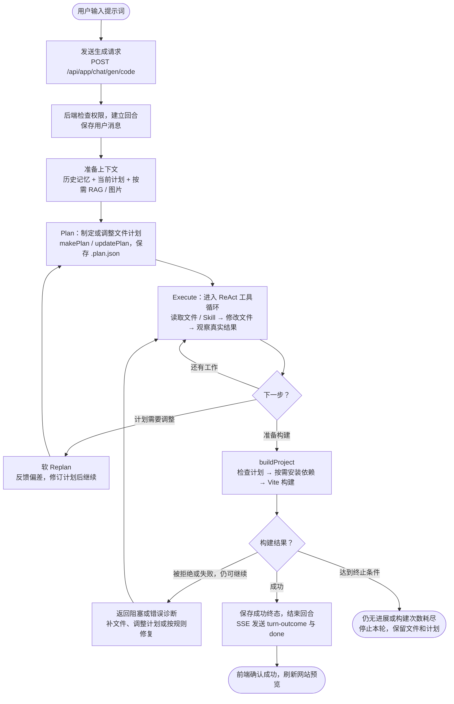

# AI App Generation

基于 **Java 25、Spring Boot、LangChain4j、MyBatis-Flex 和 Vue 3** 的 AI Web 应用生成平台，结合 **P/E（Plan / Execute）、软 Replan、ReAct、Skill、RAG、分层记忆和工具调用**，通过自然语言完成应用生成、修改、构建与发布。

支持单文件 HTML、多文件网页和 Vue 工程；用户可以查看生成过程、文件变更和计划进度，预览网站、下载源码或发布网站。

**技术框架与基础设施**

- 后端：Java 25、Spring Boot、LangChain4j、MyBatis-Flex、Spring Session、Redisson、Caffeine。
- 前端：Vue 3、TypeScript、Vite、Ant Design Vue、Pinia、Vue Router、Axios。
- 数据与存储：MySQL、Redis、Milvus、etcd、MinIO、腾讯云 COS。
- 构建与运行：Node.js、npm、Docker Compose、Nginx、Selenium、Chrome。
- 监控：Spring Boot Actuator、Micrometer、Prometheus、Grafana。

**核心机制**

- P/E + 软 Replan：先规划文件范围与依赖，执行中发现偏差后修订计划。
- ReAct + 工具调用：模型判断下一步，后端执行工具，将真实结果反馈给模型。
- Skill：通过 `readSkill` 按需读取开发指导内容，辅助当前任务。
- RAG：结合 Dense 向量检索、BM25、RRF 融合和 Rerank，为生成提供模板参考。
- 分层记忆：L0 近期上下文、L1 应用摘要、L2 用户偏好，配合 Token 预算与上下文压缩。
- 构建修复与无进展保护：根据真实构建诊断修复，反复无进展时纠偏并受控结束。
- SSE 流式展示：同步 AI 正文、工具执行过程、计划进度和回合终态。

本文介绍核心机制、启动方式和部署配置。生产迁移与运维细节见 [生产部署说明](prod/README.md) 和 [版本升级说明](prod/UPGRADE-V2.md)。

## 1. 项目架构

### 从提示词到网站预览

**统一生成入口：`POST /api/app/chat/gen/code`**，前端发送 `appId`、用户提示词 `message` 和本次任务标识 `generationId`。

新应用先通过 `POST /api/app/add` 确定生成类型并取得 `appId`；后续修改复用原应用。下面以需要修改文件的 Vue 回合为例：



模型决定“改什么、下一步做什么”，后端负责真实执行和状态确认。循环中的每次模型请求都检查 Token 预算，必要时压缩历史；正文、工具结果和计划进度通过 SSE 实时展示。

已有计划可直接复用，不必每轮重新创建。真实构建最多 3 次，构建前拒绝不计次数；纠偏后仍无进展也会受控停止。HTML、多文件和纯只读问答不走这套完整的 Vue 构建流程，网站发布则是预览之后的独立操作。

### 主要代码入口

| 环节 | 代码 |
| --- | --- |
| 前端发起请求 | [AppChatPage.vue](ai-app-generation-frontend/src/pages/app/AppChatPage.vue) → [generationSession.ts](ai-app-generation-frontend/src/utils/generationSession.ts) |
| 后端接收与编排 | [AppController.chatToGenCode](src/main/java/com/lyw/appgeneration/controller/AppController.java) → [AppServiceImpl](src/main/java/com/lyw/appgeneration/service/impl/AppServiceImpl.java) → [AiCodeGeneratorFacade](src/main/java/com/lyw/appgeneration/core/AiCodeGeneratorFacade.java) |
| 计划与工具执行 | [ai/plan](src/main/java/com/lyw/appgeneration/ai/plan)、[ai/tools](src/main/java/com/lyw/appgeneration/ai/tools) |
| 真实构建与回合结束 | [VueProjectBuilder](src/main/java/com/lyw/appgeneration/core/builder/VueProjectBuilder.java)、[VueTurnFinalizer](src/main/java/com/lyw/appgeneration/core/handler/VueTurnFinalizer.java) |

### 技术与职责对应

| 层次 | 技术与职责 |
| --- | --- |
| 前端 | Vue 3、TypeScript、Vite、Ant Design Vue、Pinia；展示生成过程并管理预览 |
| 后端 | Java 25、Spring Boot、LangChain4j、MyBatis-Flex；编排模型、工具和回合生命周期 |
| 模型 | 当前主生成、路由等配置使用 DeepSeek `deepseek-flash`；DashScope 提供 Embedding、Rerank 和图片相关能力 |
| 数据 | MySQL 保存业务和长期记忆；Redis 保存会话、缓存与近期上下文；Milvus 保存模板检索数据 |
| 运行与发布 | Node/npm 构建生成的 Vue 工程，Nginx 托管发布产物，Chrome 截图并上传腾讯云 COS |
| 监控 | Actuator、Micrometer、Prometheus、Grafana |

模型和参数以 [application.yml](src/main/resources/application.yml) 为准。Milvus 还依赖 etcd 管理元数据、MinIO 保存对象数据。

## 2. 核心生成机制

### Plan、Execute 与 ReAct

**P/E 管“做哪些事”，ReAct 管“下一步执行什么”。** P/E 在 Vue 原有 ReAct 工具循环中加入可持久化计划和执行约束。

1. **准备上下文**：加载用户需求、历史记忆、模板等；修改回合还会绑定已有计划。
2. **Plan**：没有计划时，模型调用 `makePlan`，说明目标、文件动作和依赖；已有计划需要调整时调用 `updatePlan`。
3. **Execute**：模型判断下一步并调用工具，后端执行后交回真实结果，再由模型选择下一步，即 ReAct 的“判断 → 行动 → 观察”循环。
4. **Replan**：执行中发现计划不合适，通过 `updatePlan` 修订后继续当前循环。
5. **Build**：计划满足条件后调用 `buildProject` 真正构建；成功后由后端结束本轮，前端根据终态更新预览。

这套计划与构建约束针对在线 Vue 工程。HTML 和多文件网页保留自己的生成保存流程；在线 Vue 不使用 `exit` 结束回合。

### 计划存在哪里，谁更新状态

计划以 `.plan.json` 保存在对应生成项目目录，由后端原子写入。模型通过计划工具操作，不直接读写这个文件，也没有单独的 `readPlan` 工具。后续修改回合由后端加载并注入计划摘要。

| 信息 | 谁负责 |
| --- | --- |
| 目标、文件范围、动作、依赖和修订理由 | 模型通过 `makePlan` / `updatePlan` 决定 |
| 文件是否真的修改成功 | 后端根据文件工具结果确认 |
| 文件进度、计划持久化与构建门禁 | 后端维护 |
| 计划与执行过程展示 | 前端消费工具事件，通过只读计划查询接口恢复快照 |

文件动作包括 `CREATE`、`MODIFY`、`DELETE`、`KEEP`。进度与动作分开记录：

| 文件状态 | 含义 |
| --- | --- |
| `PENDING` | 仍需完成计划要求的文件变更 |
| `TOUCHED` | 已发生可信的真实文件变更，不代表已经通过构建 |
| `OUT_OF_PLAN` | 发生了计划外文件变更，需要检查并修订计划 |

例如，修订 `router.js` 会按直接修订规则重置该条目；依赖它的 `main.js` 保留原状态，只给出兼容性检查提示。确认 `main.js` 也需修改时，模型再明确纳入修订。

`KEEP` 表示无需变更，不要求重新写文件。补建计划时，已完成且不需再改的文件可明确设为 `KEEP`；后端不会仅因“以前写过”就把新计划里的 `MODIFY` 自动标为完成。

核心代码：[AppPlanStateManager](src/main/java/com/lyw/appgeneration/ai/plan/AppPlanStateManager.java)、[VueTurnContext](src/main/java/com/lyw/appgeneration/core/handler/VueTurnContext.java)。

### 软 Replan 与无进展保护

后端根据可信工具结果检测偏差，例如修改计划外文件、读取的计划文件不存在、同一路径反复变更失败。接受偏差后标记 `REPLAN_PENDING`，通过下一次模型请求的临时反馈要求先修订计划，再继续执行。

这是**软 Replan**：继续当前回合，保留已修改文件，不重新生成整个项目。临时纠偏不进入普通聊天记忆；重复触发会去重，反馈达到上限后有 fail-open 处理，但不会因此跳过未完成文件的构建检查。

构建阻塞还有独立保护：第一次拒绝给出具体原因，第二次无进展拒绝安排纠偏；携带纠偏的模型请求获得有效响应后，仍无进展地请求构建，则结束本轮并报告失败，保留文件和计划。读取文件、只增加计划版本或修改理由不能当作进展。

核心代码：[ReplanDetector](src/main/java/com/lyw/appgeneration/ai/plan/ReplanDetector.java)、[BuildProgressGuard](src/main/java/dev/langchain4j/service/BuildProgressGuard.java)。

### 工具调用与构建修复

| 在线 Vue 工具 | 用途 |
| --- | --- |
| `makePlan` / `updatePlan` | 创建或修订计划 |
| `readDir` / `readFile` | 查看目录与文件 |
| `writeFile` / `modifyFile` / `deleteFile` | 创建、修改或删除文件 |
| `readSkill` | 读取可用的开发指导内容 |
| `buildProject` | 检查构建条件，执行真实构建并返回诊断 |

后端不会相信模型正文里的“修改成功”。文件工具使用严格的 `file-tool/v1` 八字段结果：

```text
protocol、operation、status、relativePath、changed、message、failureReason、content
```

只有合法的变更工具结果 `APPLIED + changed=true` 才计为真实修改，用于更新文件进度、构建义务和修复进展。计划和构建工具使用各自协议。

每轮最多执行 3 次真实构建。代码错误需要先有新的真实变更才能重建；依赖或基础设施错误按原重试规则处理，不要求修改业务文件。构建前被门禁拒绝不消耗真实构建次数。

最初判为只读的回合，如果后来发生真实文件修改，会进入修改执行阶段，初始化计划上下文并要求构建；不会重新分类或重启回合。没有真实修改的只读回合不能变更计划或执行构建。

核心代码：[工具目录](src/main/java/com/lyw/appgeneration/ai/tools)、[VueBuildSessionManager](src/main/java/com/lyw/appgeneration/core/builder/VueBuildSessionManager.java)、[StreamingRequestController](src/main/java/dev/langchain4j/service/StreamingRequestController.java)。

### RAG：提供模板参考

RAG 检索 `embed_text/` 中的模板知识，帮助模型选择页面结构和实现方式；它不是聊天历史，也不替模型决定当前计划。

```text
Vue 需求 → Dense 向量召回 + Milvus 原生 BM25 关键词召回
        → RRF 融合 → Rerank 重排 → 受长度限制的模板上下文 → 主生成模型
```

HTML 和多文件模式使用 Dense 链路。Embedding 使用 DashScope `text-embedding-v4`，重排使用 `gte-rerank-v2`。检索异常有降级处理，重排异常可退回原候选顺序。

模板文件必须完成摄取才能进入 Milvus。普通启动和部署默认不重新导入；已有模板与索引保存在数据卷中，重启不用重新 Embedding。首次导入或更新见 [模板导入说明](prod/UPGRADE-V2.md#模板导入与验收)，导入会调用 Embedding 并产生费用。

核心代码：[service/rag](src/main/java/com/lyw/appgeneration/service/rag)。

### 记忆管理：延续多轮需求

| 层级 | 保存什么 | 存储与默认预算 |
| --- | --- | --- |
| L0 热窗口 | 近期完整对话回合和当前执行上下文 | Redis；压缩后稳定旧回合保留目标为 12,288 Token |
| L1 应用摘要 | 当前应用的目标、约束、决策和进度 | MySQL 持久化，最多 3,072 Token |
| L2 用户偏好 | 可跨应用复用、经过证据校验的用户偏好 | MySQL 持久化并使用 Redis 缓存，召回最多 1,024 Token |

每次模型请求前统一估算消息、工具定义、工具结果等全部输入。默认达到 48K Token 启动异步压缩，达到 56K 等待压缩并复检，64K 是输入硬上限；输出另预留 8K。

旧的完整回合可以汇总到 L1，当前未完成回合不作为普通历史摘要裁剪。工具链过长还会经过专门的检查点与恢复机制，不能任意截断工具消息。压缩失败保留原历史，超预算时受控停止。

`.plan.json` 是独立执行状态，不是 L1/L2 记忆；聊天被摘要不会改写计划文件。MySQL 保留稳定对话历史，支持页面回放与热窗口恢复。

核心代码：[ai/memory](src/main/java/com/lyw/appgeneration/ai/memory)。当前按单后端实例设计，不能仅增加容器副本就假定记忆和回合状态已支持分布式协调。

### 前端如何看到执行过程

SSE 传输 AI 正文、工具参数增量、工具请求完成、工具执行结果和 `turn-outcome` 等控制事件。前端展示可信结果，不把模型说“完成了”当作构建成功。

生成中使用完整执行工作区，同时展示对话、工具与计划；成功终态确认后恢复网站预览。结果浏览时，左侧切换“对话与代码”和“计划”，计划页签隐藏输入框。失败时保留执行信息，不用失败产物刷新预览。

刷新页面后通过 `GET /api/app/{appId}/plan` 恢复计划；接口沿用应用权限，不允许直接访问或修改 `.plan.json`。

## 3. 本地启动与环境变量

以下命令在项目根目录执行。准备 Java 25、Node.js 22.12+、Docker Compose，以及 Bash、`screen`、`curl`、`lsof`；后端可使用项目 Maven Wrapper。

**当前本地 Compose 复用指定名称的已有外部数据卷。** 启动脚本会检查这些卷，新电脑没有对应卷时会失败。首次搭环境需先按 [本地 Compose](dev/docker-compose.local.yml) 配置自己的卷和数据初始化，不能把它当作任意机器上的零配置安装器。

### 启动、停止和重启

```bash
# 仅第一次复制；已有 dev/.env 时保留原配置
cp dev/.env.example dev/.env

# 填好 dev/.env 后，安装前端依赖
npm --prefix ai-app-generation-frontend ci

# 启动中间件，启动或重启前后端，再检查服务
bash scripts/start-local.sh

# 查看会停止哪些服务，不改变运行状态
bash scripts/stop-local.sh --dry-run

# 停止前后端与本项目全部中间件，保留容器和数据卷
bash scripts/stop-local.sh --confirm
```

[start-local.sh](scripts/start-local.sh) 导出 `dev/.env`，检查 Docker 与数据卷，启动缺少的 MySQL、Redis、Milvus、etcd、MinIO 和 Nginx。已经运行的中间件通常复用；本项目旧前后端进程会被停止并重新启动，其他项目占用端口则拒绝处理。日常重启前后端也可直接再次运行此脚本。

| 入口 | 默认地址或位置 |
| --- | --- |
| 推荐入口，经 Nginx | `http://localhost/` |
| Vite 开发页面 | `http://localhost:5173/` |
| 后端 API / API 文档 | `http://localhost:9025/api` / `http://localhost:9025/api/doc.html` |
| 后端健康检查 | `http://localhost:9025/api/actuator/health` |
| MySQL / Redis / Milvus | `localhost:3406` / `localhost:6379` / `localhost:19530` |
| 启停日志、前后端日志与 PID | `logs/runtime/` |

本地脚本不启动 Prometheus、Grafana，不自动安装前端依赖或导入模板。固定端口、Compose 映射和环境变量需要一起核对，改一个 `BACKEND_HOST_PORT` 不会修改整条本地链路。

### 配置从哪里读取

| 文件 | 生效方式 |
| --- | --- |
| `dev/.env` | 本地启停脚本读取；启动时导出给前后端，也供本地 Compose 使用 |
| `prod/.env` | 服务器部署脚本交给生产 Compose，再由 Compose 将声明的变量传入容器 |
| `ai-app-generation-frontend/.env.development` | Vite 开发环境读取；同名进程环境变量优先 |
| `src/main/resources/application.yml` | 后端默认配置，包含模型、记忆预算、RAG、COS 等 |

直接用 IDE 或 `mvnw spring-boot:run` 启动后端时，需要自行注入变量；Spring Boot 不会自动加载 `dev/.env`。生产 `.env` 新增变量也不会自动进入容器，必须有 Compose 对应映射。

| 常用变量 | 用途 |
| --- | --- |
| `INFRA_SHARED_PASSWORD` | 本地 MySQL、Redis、Milvus root 的共享密码；生产可使用独立密码覆盖 |
| `MILVUS_MINIO_PASSWORD` | Milvus 内部 MinIO 密码，至少 8 位 |
| `DEEPSEEK_API_KEY` | 主生成与路由等模型调用 |
| `DASHSCOPE_API_KEY` | Embedding、Rerank 和图片相关能力 |
| `PEXELS_API_KEY` | 图片素材搜索 |
| `COS_HOST`、`TEN_SERCET_ID`、`TEN_SECRET_KEY` | COS 上传与访问；`TEN_SERCET_ID` 是项目现有拼写 |
| `APP_CODE_DEPLOY_BASE_URL` | 发布网站的外部源站地址；本地通常为 `http://localhost`，云端填公网域名或地址，不加 `/api` |
| `VITE_API_BASE_URL` | 前端 API 基地址，通常为 `/api`；开发由 Vite 代理，生产由 Nginx 代理 |
| `APP_CORS_ALLOWED_ORIGINS` | 同源可留空；跨域指定可信 Origin，生产还需补齐 Compose 映射 |
| `RAG_HYBRID_ENABLED` | Vue 是否使用混合检索，默认 `true` |
| `RAG_INGEST_ENABLED`、`RAG_INGEST_TYPES` | 启动时模板摄取开关与类型；普通运行保持关闭，仅填写类型不会开启摄取 |
| `AI_MODEL_LOG_REQUESTS`、`AI_MODEL_LOG_RESPONSES` | 本地模型诊断日志开关，生产 Compose 强制关闭 |

真实 `.env` 不提交 Git。已有数据卷密码必须与配置匹配，单改 `.env` 不会自动修改 MySQL 或 Milvus 内部密码。COS 地域和桶名目前在 `application.yml` 中，换桶时只改 `COS_HOST` 不够。

## 4. 构建与云端部署

这里部署的是**平台本身**；页面上的“部署应用”按钮发布的是用户生成的网站，两者不是同一个操作。

### 脚本分别做什么

| 文件 | 执行位置 | 效果 |
| --- | --- | --- |
| `prod/build-artifacts.sh` | macOS / Linux 开发机 | 构建前后端，整理到 `prod/`，生成版本与校验清单 |
| `prod/build-artifacts.ps1` | Windows PowerShell | 同上，但要求可直接使用 `mvn` |
| `prod/package-release.py --manifest-only` | 开发机 | 已有产物时只更新版本与清单，不编译、不压缩 |
| `prod/deploy.sh` | Linux AMD64 服务器 | 校验产物，构建镜像，通过 Compose 更新容器并检查健康 |
| `prod/tools/run-rag-tool.sh` | 后端镜像内 | 独立导入或核验模板，不启动 Web 服务，用法见部署文档 |

### 本地构建产物

先安装前端依赖，准备 Java 25、Maven（Shell 入口也可用 `mvnw`）和 Python 3.9+：

```bash
# macOS / Linux，在项目根目录执行
bash prod/build-artifacts.sh /api
```

```powershell
# Windows PowerShell，在项目根目录执行
.\prod\build-artifacts.ps1 -ApiBaseUrl /api
```

脚本执行前端类型检查与打包，后端执行 `-DskipTests package`，不运行后端测试、不构建 Docker 镜像、不启动服务。成功后的主要产物：

```text
prod/
├── artifacts/backend/app.jar       后端程序
├── artifacts/frontend/dist/        前端静态页面
├── artifacts/RELEASE               本次版本号
├── artifacts/SHA256SUMS            部署文件校验清单
├── sql/schema.sql                 新数据库初始化结构
├── embed_text/                    RAG 模板源数据
└── grafana/dashboards/             监控看板
```

默认不生成压缩包或发布副本。构建会替换对应的旧前端和模板内容；只有整个脚本成功退出后，才使用本次产物。`package-release.py` 不带 `--manifest-only` 时仍保留手动生成压缩包的入口，日常构建不调用它。

`VITE_API_BASE_URL` 在构建时写入前端。构建脚本使用参数指定的地址，默认 `/api`，不自动读取 `prod/.env`；服务器仅改 `.env` 不能改变已打包页面的 API 地址。

### 上传并配置服务器

上传构建后的 `prod/`，包含 `.dockerignore`、`.env.example` 等必要隐藏文件。排除本地真实 `.env` 和日志；已有服务器保留自己的 `.env`，避免新旧 `dist` 文件混在一起。

仅全新服务器在上传目录内执行：

```bash
cp .env.example .env
chmod 600 .env
```

除了模型、存储和基础设施参数，服务器 `.env` 还要核对：

| 生产变量 | 如何填写 |
| --- | --- |
| `RELEASE_ID` | 与 `artifacts/RELEASE` 一致，每次发布使用新版本 |
| `APP_CODE_DEPLOY_BASE_URL` | 浏览器和截图服务可访问的公网源站，只保留一项，不填 `localhost` |
| `MYSQL_USER`、`REDIS_USERNAME` | 必须匹配实际服务账号 |
| `MYSQL_ROOT_PASSWORD`、`MYSQL_PASSWORD`、`REDIS_PASSWORD`、`RAG_MILVUS_PASSWORD`、`GRAFANA_ADMIN_PASSWORD` | 已有环境保留实际密码；未配置独立值时按 Compose 回退到共享密码 |
| `BACKEND_RUNTIME_IMAGE`、`NGINX_RUNTIME_IMAGE` | 新环境可留空；已有环境可指定兼容运行时镜像，复用 Java、Node、Chrome 等 |
| `BACKEND_HOST_PORT`、`PROMETHEUS_HOST_PORT`、`GRAFANA_HOST_PORT` | 宿主机暴露端口，默认 9025、9090、3000 |

### 在服务器执行部署

服务器需要 Docker Compose V2（支持 `--wait-timeout`）、Bash、Python 3.9+、`curl`、`flock`。当前完整浏览器镜像要求 Linux AMD64。

```bash
# 在服务器 prod 目录执行，全新环境
bash deploy.sh --check --all-services
bash deploy.sh --all-services

# 后续应用更新：基础服务已运行且健康时
bash deploy.sh --check
bash deploy.sh
```

`deploy.sh` 会执行 Docker Compose：先构建 `backend`、`nginx` 镜像，再启动容器。默认只更新这两个应用服务；`--all-services` 还启动或更新 MySQL、Redis、Milvus、etcd、MinIO、Prometheus、Grafana。后端运行 JAR，Nginx 提供打包后的前端。

脚本校验文件哈希、版本、平台、磁盘与服务健康，拒绝覆盖已有同版本镜像。`--check` 不启动容器，但会写检查记录并获取部署锁。日志位于生产目录上一级的 `.codex/deployments/`。

全新 MySQL 数据卷会加载初始化 SQL；已有数据库的增量迁移、RAG 模板导入和历史数据迁移需独立处理。部署不会自动回滚，也不会把本地用户、聊天记录或生成项目同步到云端。

当前 Nginx 只配置 HTTP 80，HTTPS 需要证书配置或外部网关。健康检查通过不能代替真实生成、图片、检索和发布功能的验收。详细步骤见 [prod/README.md](prod/README.md)。

## 5. 代码入口与验证

| 位置 | 从这里看什么 |
| --- | --- |
| [AiCodeGeneratorFacade](src/main/java/com/lyw/appgeneration/core/AiCodeGeneratorFacade.java) | 生成入口、上下文准备、工具与流装配 |
| [ai/plan](src/main/java/com/lyw/appgeneration/ai/plan) | 计划持久化、状态更新与偏差检测 |
| [ai/tools](src/main/java/com/lyw/appgeneration/ai/tools) | 工具实现与结果协议 |
| [dev/langchain4j/service](src/main/java/dev/langchain4j/service) | 定制的流式请求、工具循环、纠偏与恢复控制 |
| [core/handler](src/main/java/com/lyw/appgeneration/core/handler) | 回合上下文、生成事件与终态 |
| [AppChatPage.vue](ai-app-generation-frontend/src/pages/app/AppChatPage.vue) | 用户生成页面、计划与预览布局 |
| [generationSession.ts](ai-app-generation-frontend/src/utils/generationSession.ts) | 前端生成会话与事件状态 |
| [sql](sql) / [openspec](openspec) | 数据库结构、迁移与功能规格 |

```bash
# 前端类型检查和测试
npm --prefix ai-app-generation-frontend run type-check
npm --prefix ai-app-generation-frontend test

# 后端按改动选择测试，例如计划逻辑的定向回归
bash mvnw -Dtest=AppPlanStateManagerTest,PlanToolTest,BuildProjectPlanGateTest test
```

监控数据由 `/api/actuator/prometheus` 提供。排查时先看工具结果、回合终态及后端日志，再判断是模型生成、计划阻塞、真实构建还是外部依赖问题。
